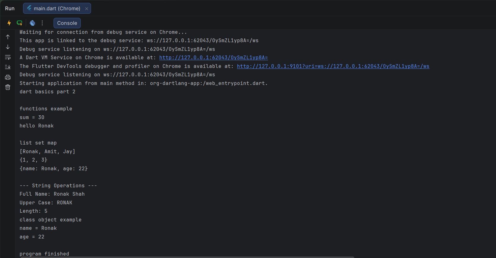

# Dart Basics (Part 2)

This repository contains Dart Basics Part 2 programs created for assignment submission.

## Files Included

- main.dart
- functions.dart
- collections.dart
- strings.dart
- student.dart

## Topics Covered

- Functions with Parameters
- Functions with Return Type
- Lists
- Sets
- Maps
- String Manipulation
- Class and Object
- Basic Object Oriented Programming

## Output Screenshot

### Program Output

## Result

All programs executed successfully without errors.
